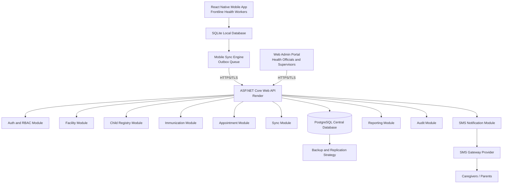
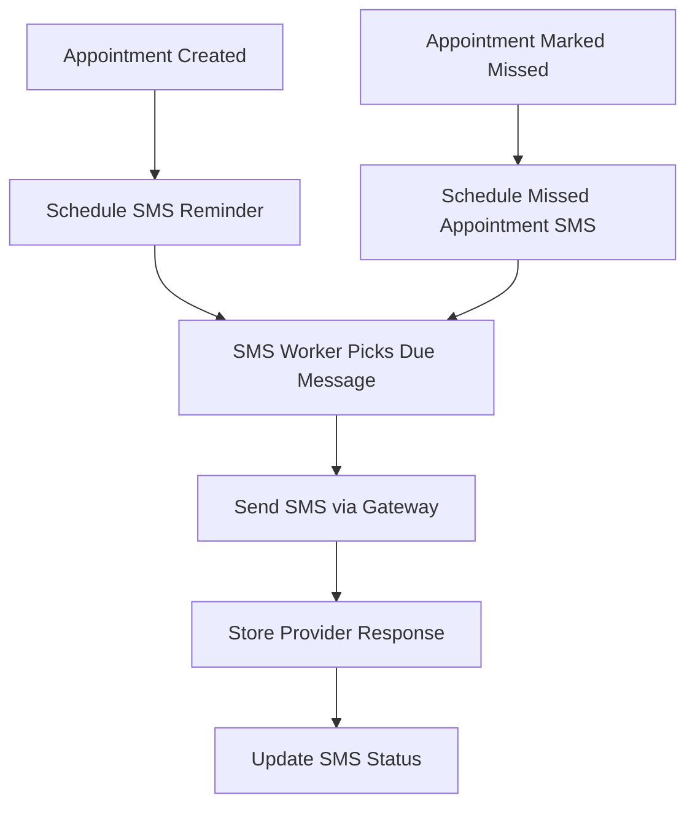

# Product Requirements Document

## Project Title

**Development of a Secure Offline-First Distributed Cloud-Based Immunization Information System for Child Healthcare in Alimosho Local Government Area**

---

## 1. Executive Summary

This project proposes the design and implementation of a secure, offline-first, distributed cloud-based immunization information system for child healthcare in Alimosho Local Government Area, Lagos State, Nigeria.

The system will provide a mobile application for frontline health workers to capture child immunization data even when internet connectivity is unavailable. Captured data will be stored locally on the mobile device using SQLite and synchronized with a cloud-hosted PostgreSQL database through a secure ASP.NET Core Web API when connectivity is restored.

The system will also provide a web-based administration portal for health officials and supervisors to manage users, facilities, immunization records, appointments, reports, and SMS notifications. An automated SMS reminder engine will send appointment reminders to caregivers and follow-up messages for missed immunization appointments.

The solution will be implemented as a functional prototype using:

- React Native for the mobile application
- ASP.NET Core Web API for the backend
- Modular Monolith architecture
- Vertical Slice Architecture
- Custom CQRS pattern
- PostgreSQL as the cloud database
- SQLite as the mobile offline database
- Render for backend deployment
- SMS gateway integration for reminders

The key technical contribution of the system is its secure offline-first data capture and synchronization model for low-connectivity healthcare environments.

---

## 2. Background and Context

Immunization is one of the most important public health interventions for reducing child morbidity and mortality. However, in many primary healthcare centres, immunization record management still depends heavily on paper-based registers, manual appointment tracking, and fragmented reporting processes.

In areas with inconsistent internet connectivity, health workers may be unable to access or update centralized systems in real time. This leads to incomplete records, delayed reporting, duplicate registrations, missed appointments, and limited visibility for supervisors and health officials.

Alimosho Local Government Area is one of the largest LGAs in Lagos State, with a high population density and significant demand for primary healthcare services. A secure digital immunization information system can improve record accuracy, appointment tracking, caregiver communication, and health decision-making.

---

## 3. Problem Statement

Primary healthcare centres in Alimosho LGA face challenges in managing child immunization records due to fragmented data collection, paper-based workflows, limited connectivity, and insufficient automated follow-up mechanisms for missed appointments.

These challenges result in:

- Incomplete immunization records
- Duplicate child registrations
- Missed vaccination appointments
- Delayed reporting to health supervisors
- Poor visibility into facility-level immunization performance
- Weak tracking of caregiver compliance
- Difficulty consolidating records across facilities
- Risk of data loss from paper-based registers

There is a need for a secure, offline-first, cloud-based immunization information system that allows frontline health workers to capture child healthcare data locally and synchronize it with a central cloud database when connectivity becomes available.

---

## 4. Aim of the Project

The aim of this project is to design, implement, test, and evaluate a secure offline-first distributed cloud-based immunization information system for improving child healthcare data management in primary health centres within Alimosho Local Government Area.

---

## 5. Specific Objectives

The specific objectives of this project are to:

1. Analyse the existing immunization data management workflow in Alimosho LGA primary health centres to identify gaps, inefficiencies, and user requirements.
2. Design a secure distributed cloud-based architecture that incorporates a cloud-hosted central database with support for replication/high availability strategies, role-based access control, data encryption at rest and in transit, offline-first mobile capture, and automated SMS reminders.
3. Implement the proposed system as a functional prototype consisting of a web admin portal, mobile app, secure RESTful API, and SMS notification service.
4. Test and validate the system for functional correctness, data synchronization reliability, SMS delivery accuracy, security effectiveness, and usability.
5. Evaluate effectiveness through completeness/accuracy of synchronized records, SMS reminder timeliness, caregiver response, reduction in data fragmentation, and user satisfaction.

---

## 6. Product Vision

To provide a secure, reliable, offline-first immunization information system that enables health workers to capture and synchronize child immunization records efficiently, reduces missed appointments through SMS reminders, and gives health officials visibility into immunization coverage and facility performance.

---

## 7. Product Goals

1. Enable offline-first child registration and immunization data capture.
2. Synchronize offline records with a centralized cloud database when connectivity is available.
3. Reduce missed appointments through automated SMS reminders.
4. Improve record completeness and accuracy.
5. Reduce data fragmentation across health facilities.
6. Provide supervisors with reporting and monitoring tools.
7. Secure sensitive child and caregiver health information.
8. Support role-based access control for different system users.
9. Provide an auditable trail of critical system activities.
10. Provide a foundation for future AI-based missed appointment prediction.

---

## 8. Target Users

### 8.1 Frontline Health Workers

Nurses, vaccinators, and community health workers responsible for registering children, recording immunizations, and managing appointments.

Primary needs:

- Register children quickly
- Capture caregiver information
- Record vaccines administered
- Work without internet connectivity
- Synchronize data when online
- View pending appointments
- Mark appointments as completed or missed
- See sync status clearly

### 8.2 Health Facility Supervisors

Users who oversee immunization activities within a health facility.

Primary needs:

- Monitor health worker activity
- View children registered at facility
- Track missed appointments
- Review immunization coverage
- Verify records
- Handle duplicate records
- Generate facility reports

### 8.3 LGA Health Officials

Users who need aggregated information across multiple primary health centres.

Primary needs:

- View immunization performance across facilities
- Monitor missed appointments
- Track SMS notification performance
- Export reports
- Identify data gaps
- Monitor synchronization health
- Manage facility-level access

### 8.4 System Administrators

Users who manage the technical configuration of the system.

Primary needs:

- Manage users, roles, facilities, vaccine schedules, devices, logs, SMS settings, and reports

### 8.5 Caregivers / Parents

Indirect users who receive SMS reminders.

Primary needs:

- Receive appointment reminders
- Receive missed appointment follow-up messages
- Receive clear, simple immunization messages
- Know where and when to take the child for vaccination

---

## 9. Product Scope

### 9.1 In Scope

- Mobile application for health workers
- Offline child registration
- Offline caregiver registration
- Offline immunization record capture
- Offline appointment status updates
- SQLite local storage
- Sync queue/outbox mechanism
- Secure backend API
- PostgreSQL central database
- Admin web portal
- User and role management
- Facility management
- Vaccine schedule management
- Appointment management
- SMS reminder engine
- Missed appointment SMS follow-up
- Reporting dashboard
- Audit logging
- Device registration
- Sync monitoring
- Basic duplicate child detection
- Authentication and authorization
- Data encryption strategy
- Render deployment for backend

### 9.2 Out of Scope for Initial Prototype

- AI missed appointment prediction
- Full national-level deployment
- Real-time bidirectional sync guarantees
- Biometric patient identification
- Integration with national health systems
- USSD integration
- WhatsApp integration
- Payment systems
- Electronic medical record integration
- Full enterprise-grade multi-region database replication
- Native iOS and Android separate codebases

### 9.3 Future Scope

- AI prediction model for missed appointments
- GIS-based coverage mapping
- WhatsApp notification support
- USSD support
- QR-code immunization certificate
- National health records integration
- Vaccine inventory management
- Advanced analytics
- Multi-language SMS templates
- Caregiver mobile app
- Biometric verification
- Inter-facility child record transfer

---

## 10. Product Assumptions

1. Health workers may experience unstable or unavailable internet connectivity.
2. Mobile devices may need to operate offline for several hours or days.
3. The central database will be hosted in the cloud.
4. Health workers will authenticate before using the app.
5. Caregivers may not have smartphones but are likely to have phone numbers capable of receiving SMS.
6. SMS delivery depends on the availability and reliability of the external SMS gateway.
7. The prototype will use Render for backend deployment.
8. The mobile app will use SQLite or an SQLite-based local storage solution.
9. PostgreSQL will serve as the central persistent database.
10. Database replication may be architecturally supported but may not be fully implemented in the prototype due to hosting constraints.
11. Background sync on mobile devices is best-effort and cannot be guaranteed by the operating system.
12. The system will use eventual consistency between local mobile data and the cloud database.

---

## 11. Constraints

### 11.1 Technical Constraints

- Backend: ASP.NET Core Web API
- Backend architecture: Modular Monolith
- Application style: Vertical Slice Architecture
- CQRS: custom lightweight dispatcher, not MediatR
- Mobile app: React Native
- Deployment: Render
- Central database: PostgreSQL
- Offline mobile database: SQLite
- Notifications: external SMS gateway provider

### 11.2 Operational Constraints

- Network connectivity may be unreliable.
- Health workers may have limited technical expertise.
- Mobile devices may have limited storage and battery capacity.
- SMS delivery may fail due to telecom provider issues.
- Some health facilities may have inconsistent power supply.

### 11.3 Security Constraints

- Sensitive data must be protected in transit and at rest.
- Unauthorized users must not access health records.
- Role-based access must be enforced at API level.
- Local mobile data must be protected against device loss or theft.
- Audit logs must be maintained for critical operations.

---

## 12. Success Metrics

### 12.1 Data Capture Metrics

- Number of children registered
- Number of caregiver records captured
- Number of immunization events recorded
- Percentage of records captured offline
- Percentage of offline records successfully synchronized
- Number of duplicate records detected

### 12.2 Sync Metrics

- Sync success rate
- Sync failure rate
- Average sync completion time
- Number of pending sync records
- Number of conflict records
- Number of retry attempts per sync batch
- Percentage of records synchronized without manual intervention

### 12.3 SMS Metrics

- Number of appointment reminders scheduled
- Number of SMS messages sent
- Number of SMS messages delivered
- Number of SMS messages failed
- Average time between scheduled reminder and actual SMS dispatch
- Appointment attendance rate after SMS reminder
- Missed appointment follow-up rate

### 12.4 Security Metrics

- Percentage of endpoints protected by authentication
- Percentage of role-protected operations correctly enforced
- Number of unauthorized access attempts blocked
- Verification that sensitive mobile data is encrypted
- Verification that API communication uses HTTPS
- Number of audit events logged

### 12.5 Usability Metrics

- Health worker task completion rate
- Average time to register a child
- Average time to record vaccination
- User satisfaction score
- Perceived ease of use
- Error rate during data entry
- Number of support issues reported during testing

---

## 13. User Roles and Permissions

### 13.1 System Administrator

- Manage users, roles, facilities, vaccine schedules, SMS settings, devices, audit logs, and system reports

### 13.2 LGA Health Official

- View facilities in Alimosho LGA
- View aggregated immunization reports
- View missed appointment reports
- View SMS delivery reports
- View sync status reports
- Export reports
- Review duplicate records

### 13.3 Facility Supervisor

- View records for assigned facility
- View health worker activity
- View facility reports
- Review children registered in facility
- Review missed appointments
- Review duplicate records within facility

### 13.4 Health Worker

- Register children
- Register caregivers
- Record immunizations
- Create appointments
- Update appointment status
- View assigned facility records
- Sync offline data
- View own sync status

### 13.5 Auditor / Read-Only User

- View reports, audit logs, and system activity
- Cannot create, update, or delete records

---

## 14. Functional Requirements

## 14.1 Authentication and Authorization

### FR-AUTH-001: User Login

The system shall allow authorized users to log in using valid credentials.

Acceptance criteria:

- User can submit email/username and password.
- System validates credentials.
- System returns access token and refresh token on successful login.
- System denies access for invalid credentials.
- Login attempts are logged.

### FR-AUTH-002: Refresh Token

The system shall support secure refresh token rotation.

Acceptance criteria:

- Expired access tokens can be refreshed using a valid refresh token.
- Used refresh tokens cannot be reused.
- Invalid refresh tokens are rejected.
- Refresh activity is logged.

### FR-AUTH-003: Role-Based Access Control

The system shall enforce access based on user roles.

Acceptance criteria:

- Health workers cannot access administrator features.
- Facility supervisors can only access assigned facility records.
- LGA officials can access cross-facility reports.
- Unauthorized attempts return 403 Forbidden.
- All protected endpoints require authentication.

### FR-AUTH-004: Logout

The system shall allow users to log out.

Acceptance criteria:

- Refresh token is invalidated.
- User session is ended on the client.
- Local sensitive session data is cleared.

---

## 14.2 User Management

### FR-USER-001: Create User

The system shall allow administrators to create user accounts.

Acceptance criteria:

- Admin can create users with name, email/username, phone number, role, and facility.
- Password is securely hashed.
- Duplicate email/username is rejected.
- User creation is audit logged.

### FR-USER-002: Update User

The system shall allow administrators to update user details.

Acceptance criteria:

- Admin can update name, role, phone number, and facility assignment.
- User update is audit logged.
- Invalid role assignment is rejected.

### FR-USER-003: Disable User

The system shall allow administrators to disable a user account.

Acceptance criteria:

- Disabled users cannot log in.
- Existing refresh tokens are revoked.
- Disable action is audit logged.

---

## 14.3 Facility Management

### FR-FAC-001: Create Facility

The system shall allow administrators to create primary health centre records.

Acceptance criteria:

- Facility name, code, address, ward, and LGA are captured.
- Facility code must be unique.
- Facility is available for user assignment.

### FR-FAC-002: Update Facility

The system shall allow administrators to update facility information.

Acceptance criteria:

- Facility details can be updated.
- Changes are audit logged.
- Facility code uniqueness is enforced.

### FR-FAC-003: View Facilities

The system shall allow authorized users to view facilities based on their role.

Acceptance criteria:

- Admin can view all facilities.
- LGA official can view facilities within Alimosho LGA.
- Facility supervisor can view assigned facility.

---

## 14.4 Child Registration

### FR-CHILD-001: Register Child Offline

The mobile app shall allow health workers to register a child while offline.

Acceptance criteria:

- Health worker can enter child biodata.
- Health worker can enter caregiver information.
- App validates required fields locally.
- Record is saved in SQLite.
- A pending sync item is created in SyncQueue.
- Child record is marked as PendingSync.

Required fields:

- First name
- Last name
- Date of birth
- Sex
- Caregiver name
- Caregiver phone number
- Facility ID
- Health worker ID

Optional fields:

- Middle name
- Address
- Ward
- Birth weight
- Place of birth

### FR-CHILD-002: Register Child Online

The mobile app shall allow health workers to register a child while online.

Acceptance criteria:

- Record is saved locally first.
- Sync is attempted immediately.
- If sync succeeds, record is marked Synced.
- If sync fails, record remains PendingSync.

### FR-CHILD-003: Search Child

The system shall allow authorized users to search for child records.

Acceptance criteria:

- Search by child name.
- Search by caregiver phone number.
- Search by child ID.
- Search by facility.
- Role-based access is enforced.

### FR-CHILD-004: Duplicate Detection

The system shall detect possible duplicate child records.

Acceptance criteria:

- System compares name, date of birth, sex, caregiver phone number, and facility.
- Possible duplicates are flagged.
- Duplicates are not automatically merged.
- Supervisor can review duplicates.

---

## 14.5 Guardian / Caregiver Management

### FR-GUARD-001: Register Caregiver

The system shall allow caregiver information to be captured.

Acceptance criteria:

- Caregiver name and phone number are required.
- Relationship to child can be captured.
- Address can be captured.
- Phone number format is validated.

### FR-GUARD-002: Update Caregiver Phone Number

The system shall allow authorized users to update caregiver phone number.

Acceptance criteria:

- Update is saved locally if offline.
- Update creates a sync queue item.
- Update is audit logged after sync.
- Latest valid update is applied unless conflict is detected.

---

## 14.6 Vaccine Schedule Management

### FR-VACC-001: Manage Vaccines

The system shall allow administrators to manage vaccine records.

Acceptance criteria:

- Admin can create vaccine records.
- Admin can update vaccine name and description.
- Admin can disable obsolete vaccines.
- Changes are included in download sync to mobile devices.

### FR-VACC-002: Manage Immunization Schedule

The system shall allow administrators to configure vaccine schedules.

Acceptance criteria:

- Admin can define vaccine due age.
- Admin can define dose sequence.
- Admin can define recommended time window.
- Mobile app can download updated schedule.

---

## 14.7 Immunization Recording

### FR-IMM-001: Record Vaccination Offline

The mobile app shall allow health workers to record vaccination events offline.

Acceptance criteria:

- Health worker selects child.
- Health worker selects vaccine and dose.
- Vaccination date is captured.
- Facility and health worker IDs are captured.
- Record is stored locally in SQLite.
- Sync queue item is created.
- Vaccination record is append-only.

### FR-IMM-002: Prevent Duplicate Dose

The system shall warn when the same vaccine dose appears to have already been recorded.

Acceptance criteria:

- App checks local records.
- Backend checks cloud records during sync.
- Duplicate dose is rejected or flagged for review.
- Rejection reason is returned to mobile app.

### FR-IMM-003: View Immunization History

The system shall allow authorized users to view a child’s immunization history.

Acceptance criteria:

- Mobile app displays locally available immunization history.
- Web portal displays synchronized immunization history.
- History includes vaccine, dose, date, facility, and health worker.

### FR-IMM-004: Correction of Immunization Record

The system shall not allow destructive deletion of immunization records.

Acceptance criteria:

- Corrections are handled using correction records.
- Original record remains preserved.
- Correction is audit logged.
- Authorized supervisor approval may be required.

---

## 14.8 Appointment Management

### FR-APP-001: Create Appointment

The system shall create the next immunization appointment based on vaccine schedule.

Acceptance criteria:

- Appointment is generated after child registration or vaccination event.
- Appointment includes child, vaccine/dose due, facility, and date.
- Appointment can be saved offline.
- Appointment is synchronized to server.

### FR-APP-002: View Upcoming Appointments

The mobile app shall show upcoming appointments for the health worker’s facility.

Acceptance criteria:

- Health worker can view appointments due today.
- Health worker can view appointments due this week.
- Records are available offline after sync.

### FR-APP-003: Mark Appointment Completed

The system shall allow appointments to be marked completed.

Acceptance criteria:

- Appointment status changes to Completed.
- Related immunization record is linked.
- Change can be captured offline.
- Change syncs to server.

### FR-APP-004: Mark Appointment Missed

The system shall allow appointments to be marked missed.

Acceptance criteria:

- Appointment status changes to Missed.
- Missed status triggers follow-up SMS scheduling.
- Action is audit logged.

---

## 14.9 Offline Data Capture

### FR-OFF-001: Offline Mode Detection

The mobile app shall detect whether the device is online or offline.

Acceptance criteria:

- App displays current connectivity status.
- App allows data capture while offline.
- App does not block critical workflows due to no connectivity.

### FR-OFF-002: Local Storage

The mobile app shall store data locally using SQLite.

Acceptance criteria:

- Child, guardian, immunization, appointment, and sync state records are stored locally.

### FR-OFF-003: Local Validation

The mobile app shall validate data before saving locally.

Acceptance criteria:

- Required fields are validated.
- Invalid dates are rejected.
- Invalid phone numbers are flagged.
- Duplicate local entries are warned.

---

## 14.10 Synchronization

### FR-SYNC-001: Sync Queue Creation

The mobile app shall create a sync queue item for each offline write operation.

Acceptance criteria:

- Each create/update action creates a SyncQueue record.
- Each SyncQueue record has a unique ClientChangeId.
- SyncQueue records include entity type, entity ID, operation type, payload, and timestamp.
- SyncQueue records are durable and survive app restart.

### FR-SYNC-002: Upload Sync

The mobile app shall upload pending sync records to the backend API when connectivity is available.

Acceptance criteria:

- App reads pending SyncQueue items.
- App uploads records in batches.
- Backend validates each item.
- Backend returns item-level success/failure.
- App marks successful items as Synced.
- Failed items remain available for retry.

### FR-SYNC-003: Download Sync

The mobile app shall download server-side changes since the last successful sync version.

Acceptance criteria:

- App sends last pulled server version.
- Backend returns changes after that version.
- App applies server changes to SQLite.
- App updates last pulled version after successful application.

### FR-SYNC-004: Idempotency

The backend shall prevent duplicate processing of repeated sync events.

Acceptance criteria:

- Backend stores ClientChangeId and DeviceId in SyncInbox.
- Duplicate ClientChangeId from same device is not processed twice.
- Backend returns previous result for duplicate sync event.

### FR-SYNC-005: Conflict Handling

The system shall detect and handle synchronization conflicts.

Acceptance criteria:

- Duplicate child records are flagged for review.
- Vaccination records are append-only.
- Facility and vaccine schedule changes follow server-wins rule.
- Guardian phone updates use latest valid update unless conflict exists.
- Conflict status is returned to mobile app.

### FR-SYNC-006: Manual Sync

The mobile app shall provide a manual Sync Now button.

Acceptance criteria:

- Health worker can trigger sync manually.
- App displays progress.
- App displays success/failure summary.

### FR-SYNC-007: Sync Status Display

The mobile app shall display sync status.

Acceptance criteria:

- App shows pending sync count.
- App shows failed sync count.
- App shows last successful sync time.
- App shows current sync status.

---

## 14.11 SMS Notification

### FR-SMS-001: Appointment Reminder SMS

The system shall send SMS reminders for upcoming immunization appointments.

Acceptance criteria:

- SMS is scheduled when appointment is created.
- SMS is sent before appointment date.
- SMS content includes child name, appointment date, and facility.
- SMS attempt is logged.

### FR-SMS-002: Same-Day Reminder SMS

The system shall send SMS on the appointment day.

Acceptance criteria:

- System identifies appointments due today.
- SMS is sent to caregiver phone number.
- Delivery attempt is logged.

### FR-SMS-003: Missed Appointment SMS

The system shall send follow-up SMS for missed appointments.

Acceptance criteria:

- Missed appointment triggers follow-up message.
- SMS is sent to caregiver.
- Follow-up attempt is logged.

### FR-SMS-004: SMS Delivery Status

The system shall track SMS delivery status when supported by the gateway.

Acceptance criteria:

- Submitted, delivered, and failed statuses are recorded.
- Failure reason is stored where available.

### FR-SMS-005: SMS Template Management

The system shall allow administrators to manage SMS templates.

Acceptance criteria:

- Admin can create and update templates.
- Templates support placeholders.
- Only active templates are used.

---

## 14.12 Reporting and Dashboard

### FR-REP-001: Immunization Coverage Report

The system shall provide immunization coverage reports.

Acceptance criteria:

- Report can be filtered by facility and date range.
- Report shows registered children, completed immunizations, and missed appointments.

### FR-REP-002: Missed Appointment Report

The system shall provide missed appointment reports.

Acceptance criteria:

- Report lists missed appointments, caregiver contact, and SMS follow-up status.
- Report can be filtered by facility and date.

### FR-REP-003: Sync Reliability Report

The system shall provide sync performance reports.

Acceptance criteria:

- Report shows total sync batches, successful sync events, failed sync events, conflicts, and devices with sync issues.

### FR-REP-004: SMS Delivery Report

The system shall provide SMS delivery reports.

Acceptance criteria:

- Report shows sent, delivered, and failed SMS counts.
- Report shows delivery rate and failure reasons where available.

---

## 14.13 Audit Logging

### FR-AUD-001: Critical Activity Logging

The system shall log critical user actions including login attempts, child registration, immunization recording, appointment status changes, user management, role changes, and sync uploads.

### FR-AUD-002: Audit Log Viewing

Authorized users shall be able to view audit logs filtered by user, action, entity, and date. Audit logs must not be modifiable from the portal.

---

## 15. Non-Functional Requirements

### NFR-001: Availability

The backend API should be available through cloud deployment. Prototype uptime depends on Render service availability. The architecture should support future high availability deployment.

### NFR-002: Offline Capability

The mobile application must support registering children, registering caregivers, recording vaccination, creating appointments, updating appointment status, and viewing locally available records without internet connectivity.

### NFR-003: Synchronization Reliability

Pending records must not be lost. Sync queue must survive app restart. Failed sync items must be retried. Duplicate processing must be prevented. Item-level sync results must be returned.

### NFR-004: Security

The system must support HTTPS, RBAC, password hashing, refresh token security, local database encryption, audit logging, device registration, and input validation.

### NFR-005: Data Encryption

Data in transit shall use HTTPS/TLS-secured communication. TLS 1.3 should be targeted where supported. Server database encryption will rely on managed PostgreSQL capabilities where available. Mobile database encryption should use encrypted SQLite or SQLCipher.

### NFR-006: Performance

- Common API response time: under 1 second under normal prototype load
- Mobile local save operation: under 500ms
- Sync batch size: 20 to 50 records
- Dashboard report queries: under 3 seconds for prototype dataset

### NFR-007: Usability

The system should provide simple forms, clear required fields, offline/online status, sync status, clear error messages, and minimal navigation complexity.

### NFR-008: Maintainability

The backend must use Modular Monolith architecture, Vertical Slice organization, custom CQRS dispatcher, clear module boundaries, tests, centralized error handling, and structured logging.

### NFR-009: Scalability

The system should use stateless API design, PostgreSQL, background worker support, sync batch processing, database indexing, and pagination for large result sets.

### NFR-010: Auditability

Audit logs must include user ID, device ID, action, entity type, entity ID, timestamp, and metadata.

---

## 16. System Architecture



---

## 17. Synchronization Design

### 17.1 Sync Principle

SQLite and PostgreSQL will not communicate directly.

The sync path is:

```text
SQLite → Mobile Sync Engine → ASP.NET Core Sync API → PostgreSQL
PostgreSQL → ASP.NET Core Sync API → Mobile Sync Engine → SQLite
```

The backend API is the only bridge between local mobile data and the central cloud database.

### 17.2 Sync Model

The system will use:

- Client-generated UUIDs
- Local SyncQueue / Outbox pattern
- Server-side SyncInbox for idempotency
- ServerChangeLog for download sync
- Version-based sync instead of timestamp-only sync
- Batch upload
- Retry with exponential backoff
- Conflict detection
- Manual and automatic sync triggers

### 17.3 Upload Sync

Upload sync moves local changes from SQLite to PostgreSQL.

Flow:

1. Health worker performs an action.
2. Mobile app validates input.
3. Mobile app saves record to SQLite.
4. Mobile app creates SyncQueue item.
5. Sync engine detects connectivity.
6. Sync engine sends pending items to `/api/sync/upload`.
7. Backend validates each item.
8. Backend stores accepted records in PostgreSQL.
9. Backend stores ClientChangeId in SyncInbox.
10. Backend writes changes to ServerChangeLog.
11. Backend returns item-level result.
12. Mobile app marks item as Synced, Failed, or Conflict.

### 17.4 Download Sync

Download sync moves server-side changes from PostgreSQL to SQLite.

Flow:

1. Mobile app stores LastPulledServerVersion.
2. Mobile app calls `/api/sync/download?sinceVersion={version}`.
3. Backend reads ServerChangeLog after that version.
4. Backend returns changes relevant to the health worker’s facility and permissions.
5. Mobile app applies changes to SQLite.
6. Mobile app updates LastPulledServerVersion.

### 17.5 Sync Triggers

- App startup sync
- Network reconnect sync
- Manual Sync Now button
- Immediate sync after important online action
- Best-effort background sync

Background sync must not be the only synchronization mechanism because mobile operating systems may delay or prevent background jobs.

### 17.6 Sync Conflict Rules

| Entity | Conflict Strategy |
|---|---|
| Child | Possible duplicates are flagged for supervisor review |
| Guardian phone | Latest valid update wins unless duplicate conflict exists |
| Immunization record | Append-only; do not overwrite |
| Appointment status | Latest valid status wins |
| Vaccine schedule | Server wins |
| Facility data | Server wins |
| Audit log | Append-only |
| SMS log | Append-only |

### 17.7 Sync Statuses

Local SyncQueue statuses:

```text
Pending
Syncing
Synced
Failed
Conflict
Retrying
```

### 17.8 Sync API Endpoints

#### Upload Changes

```http
POST /api/sync/upload
```

Request:

```json
{
  "deviceId": "device_001",
  "facilityId": "facility_001",
  "healthWorkerId": "user_001",
  "changes": [
    {
      "clientChangeId": "change_001",
      "entityType": "Child",
      "entityId": "child_001",
      "operationType": "Create",
      "payload": {},
      "clientTimestamp": "2026-05-24T10:30:00Z"
    }
  ]
}
```

Response:

```json
{
  "syncBatchId": "batch_001",
  "serverVersion": 1021,
  "results": [
    {
      "clientChangeId": "change_001",
      "entityId": "child_001",
      "status": "Accepted",
      "message": "Child synced successfully"
    }
  ]
}
```

#### Download Changes

```http
GET /api/sync/download?sinceVersion=1021
```

Response:

```json
{
  "serverVersion": 1030,
  "changes": [
    {
      "changeVersion": 1022,
      "entityType": "Vaccine",
      "entityId": "vaccine_bcg",
      "operationType": "Update",
      "payload": {},
      "serverTimestamp": "2026-05-24T11:00:00Z"
    }
  ]
}
```

---

## 18. SMS Reminder Design

### 18.1 SMS Reminder Types

- UpcomingAppointmentReminder
- SameDayAppointmentReminder
- MissedAppointmentFollowUp
- CampaignNotification

### 18.2 SMS Flow



### 18.3 SMS Statuses

```text
Pending
Queued
Sent
Delivered
Failed
Cancelled
```

### 18.4 Sample SMS Templates

Upcoming appointment:

```text
Dear Parent/Guardian, your child {ChildName} is due for immunization at {FacilityName} on {AppointmentDate}. Please attend on time.
```

Same-day reminder:

```text
Reminder: {ChildName} has an immunization appointment today at {FacilityName}. Please visit the facility as scheduled.
```

Missed appointment:

```text
Dear Parent/Guardian, {ChildName} missed an immunization appointment at {FacilityName}. Please visit the facility as soon as possible.
```

---

## 19. Data Model Overview

Core entities:

- User
- Role
- Facility
- Device
- Child
- Guardian
- Vaccine
- VaccineSchedule
- ImmunizationRecord
- Appointment
- SyncInbox
- ServerChangeLog
- SmsNotification
- SmsDeliveryAttempt
- AuditLog

---

## 20. Core Database Tables

### Users

```text
Id
FullName
Email
PhoneNumber
PasswordHash
RoleId
FacilityId
IsActive
CreatedAt
UpdatedAt
```

### Roles

```text
Id
Name
Description
CreatedAt
UpdatedAt
```

### Facilities

```text
Id
Name
Code
Address
Ward
Lga
State
IsActive
CreatedAt
UpdatedAt
```

### Devices

```text
Id
DeviceIdentifier
UserId
FacilityId
DeviceName
Platform
IsApproved
LastSeenAt
CreatedAt
UpdatedAt
```

### Children

```text
Id
FirstName
MiddleName
LastName
DateOfBirth
Sex
GuardianId
FacilityId
RegistrationSource
CreatedByUserId
CreatedByDeviceId
IsPossibleDuplicate
CreatedAt
UpdatedAt
DeletedAt
Version
```

### Guardians

```text
Id
FullName
PhoneNumber
AlternativePhoneNumber
RelationshipToChild
Address
Ward
CreatedAt
UpdatedAt
Version
```

### Vaccines

```text
Id
Name
Code
Description
IsActive
CreatedAt
UpdatedAt
```

### VaccineSchedules

```text
Id
VaccineId
DoseName
RecommendedAgeInWeeks
MinimumAgeInWeeks
MaximumAgeInWeeks
Sequence
IsActive
CreatedAt
UpdatedAt
```

### ImmunizationRecords

```text
Id
ChildId
VaccineId
DoseName
DateAdministered
FacilityId
AdministeredByUserId
CreatedByDeviceId
Notes
IsCorrection
CorrectedRecordId
CreatedAt
Version
```

### Appointments

```text
Id
ChildId
VaccineId
DoseName
FacilityId
AppointmentDate
Status
CompletedAt
MissedAt
CreatedAt
UpdatedAt
Version
```

### SyncInbox

```text
Id
ClientChangeId
DeviceId
EntityType
EntityId
OperationType
Status
ProcessedAt
ResultMessage
CreatedAt
```

### ServerChangeLog

```text
ChangeVersion
EntityType
EntityId
OperationType
PayloadJson
FacilityId
CreatedAt
CreatedByUserId
```

### SmsNotifications

```text
Id
AppointmentId
ChildId
GuardianId
PhoneNumber
Message
NotificationType
Status
ScheduledAt
SentAt
DeliveredAt
FailedAt
ProviderMessageId
FailureReason
CreatedAt
UpdatedAt
```

### SmsDeliveryAttempts

```text
Id
SmsNotificationId
AttemptNumber
Provider
ProviderResponse
Status
AttemptedAt
```

### AuditLogs

```text
Id
UserId
DeviceId
Action
EntityType
EntityId
IpAddress
MetadataJson
CreatedAt
```

---

## 21. API Endpoint Overview

### Authentication

```http
POST /api/auth/login
POST /api/auth/refresh-token
POST /api/auth/logout
```

### Users

```http
POST /api/users
GET /api/users
GET /api/users/{id}
PUT /api/users/{id}
POST /api/users/{id}/disable
```

### Facilities

```http
POST /api/facilities
GET /api/facilities
GET /api/facilities/{id}
PUT /api/facilities/{id}
```

### Children

```http
POST /api/children
GET /api/children
GET /api/children/{id}
GET /api/children/search
PUT /api/children/{id}
GET /api/children/duplicates
```

### Guardians

```http
POST /api/guardians
GET /api/guardians/{id}
PUT /api/guardians/{id}
```

### Vaccines

```http
POST /api/vaccines
GET /api/vaccines
PUT /api/vaccines/{id}
POST /api/vaccines/{id}/disable
```

### Immunizations

```http
POST /api/immunizations
GET /api/immunizations/child/{childId}
POST /api/immunizations/{id}/corrections
```

### Appointments

```http
POST /api/appointments
GET /api/appointments
GET /api/appointments/upcoming
POST /api/appointments/{id}/complete
POST /api/appointments/{id}/mark-missed
```

### Sync

```http
POST /api/sync/upload
GET /api/sync/download
GET /api/sync/status
```

### Notifications

```http
GET /api/notifications/sms
POST /api/notifications/sms/send-test
POST /api/notifications/sms/provider-callback
```

### Reports

```http
GET /api/reports/immunization-coverage
GET /api/reports/missed-appointments
GET /api/reports/sms-delivery
GET /api/reports/sync-reliability
GET /api/reports/facility-performance
```

### Audit Logs

```http
GET /api/audit-logs
```

---

## 22. Web Admin Portal Requirements

The web portal shall support:

- Login
- Dashboard
- User Management
- Facility Management
- Vaccine Schedule Management
- Child Search
- Immunization Records View
- Appointment Monitoring
- Missed Appointment Report
- SMS Notification Report
- Sync Reliability Report
- Duplicate Record Review
- Audit Log Viewer

Recommended dashboard cards:

- Total Registered Children
- Total Immunizations Recorded
- Appointments Due Today
- Missed Appointments
- SMS Sent Today
- SMS Failed Today
- Pending Sync Events
- Possible Duplicate Records

---

## 23. Mobile App Screens

The mobile app shall include:

- Login Screen
- Home Dashboard
- Register Child Screen
- Caregiver Form
- Child Search Screen
- Child Profile Screen
- Record Immunization Screen
- Appointment List Screen
- Appointment Detail Screen
- Sync Status Screen
- Settings Screen

Mobile dashboard should show:

- Connection Status
- Last Sync Time
- Pending Sync Count
- Failed Sync Count
- Children Registered Today
- Appointments Due Today
- Sync Now Button

---

## 24. Security Design

### 24.1 Authentication

- JWT access tokens
- Refresh token rotation
- Secure token storage on mobile
- Password hashing with BCrypt or Argon2
- Session revocation on logout

### 24.2 Authorization

- Role-based access control
- Endpoint-level authorization
- Facility-level data restriction
- User status validation

### 24.3 Encryption

Data in transit:

```text
HTTPS/TLS-secured communication.
TLS 1.3 should be targeted where supported by hosting infrastructure.
```

Data at rest:

```text
PostgreSQL managed encryption where available.
Encrypted SQLite or SQLCipher for local mobile database.
Application-level encryption for highly sensitive fields where required.
```

### 24.4 Audit

Audit logs should capture:

- User ID
- Device ID
- Action
- Entity type
- Entity ID
- Timestamp
- IP address
- Metadata

### 24.5 Device Security

- Each mobile device should be registered.
- Device ID should be included in sync requests.
- Admin should be able to revoke a device.
- Revoked devices should not be allowed to sync.

---

## 25. Testing Strategy

### 25.1 Functional Testing

Test user login, child registration, caregiver registration, vaccination recording, appointment creation, appointment completion, missed appointment marking, SMS scheduling, and report generation.

### 25.2 Offline Testing

Test child registration, vaccination recording, appointment creation, app restart before sync, data persistence, internet reconnection, and pending record synchronization.

### 25.3 Sync Testing

Test successful upload sync, failed sync retry, duplicate sync request idempotency, download sync, conflict detection, batch upload, and last pulled server version update.

### 25.4 Security Testing

Test invalid login, protected endpoint without token, unauthorized role endpoint access, facility data isolation, token expiration, refresh token reuse detection, encrypted local storage, and HTTPS enforcement.

### 25.5 SMS Testing

Test SMS scheduling, sending, failed SMS retry, delivery status callback, missed appointment follow-up, and SMS template placeholder replacement.

### 25.6 Usability Testing

Test whether health workers can register children, record vaccination, identify pending sync records, and whether supervisors can find missed appointment reports.

---

## 26. Evaluation Plan

### 26.1 Functional Correctness

Measured by passed test cases, successful workflow completion, and error rates.

### 26.2 Synchronization Reliability

Measured by percentage of offline records synchronized successfully, average sync time after reconnection, failed sync records, conflict records, and idempotency under repeated requests.

### 26.3 SMS Effectiveness

Measured by SMS delivery rate, failure rate, reminder timeliness, appointment attendance after reminders, and missed appointment follow-up completion.

### 26.4 Security Effectiveness

Measured by RBAC enforcement, unauthorized access blocked, data encryption checks, audit logs generated, and token security tests passed.

### 26.5 Usability

Measured by user satisfaction questionnaire, task completion time, user error rate, and perceived ease of use.

---

## 27. Deployment Strategy

### 27.1 Backend Deployment

The backend will be deployed as a Render Web Service.

Components:

- ASP.NET Core Web API
- PostgreSQL database
- Optional Render Background Worker for SMS jobs
- Environment variables for secrets

### 27.2 Background Worker

Option A: Use ASP.NET Core BackgroundService inside the API application.

Option B: Deploy a separate Render Worker Service for SMS reminders and scheduled jobs.

Recommended prototype approach: Use BackgroundService inside the API for simplicity. If deployment resources allow, separate it into a Render Worker.

### 27.3 Database

For prototype: Single managed PostgreSQL instance with automated backup where available.

For future production: High availability PostgreSQL, read replica, point-in-time recovery, and multi-zone deployment.

---

## 28. Risks and Mitigation

| Risk | Impact | Mitigation |
|---|---|---|
| Poor internet connectivity | Records may not sync immediately | Offline-first design and durable sync queue |
| Device loss | Sensitive local data exposure | Encrypted local database and device revocation |
| Duplicate child registration | Data quality issue | Duplicate detection and supervisor review |
| SMS delivery failure | Caregiver may miss reminder | Retry logic and delivery status tracking |
| Background sync limitation | Delayed sync | Multiple sync triggers and manual Sync Now |
| Render plan limitation | Limited HA capability | Document HA as architecture-supported and use backups |
| User adoption difficulty | Low usage | Simple UX and usability testing |
| Data conflicts | Inconsistent records | Conflict detection and entity-specific resolution rules |

---

## 29. Milestones

### Milestone 1: Requirements and Workflow Analysis

Deliverables: current workflow diagram, user roles, pain points, functional requirements, and non-functional requirements.

### Milestone 2: Architecture and Database Design

Deliverables: system architecture diagram, database schema, sync architecture, security architecture, and API contract.

### Milestone 3: Backend Foundation

Deliverables: ASP.NET Core project setup, Modular Monolith structure, custom CQRS dispatcher, PostgreSQL setup, authentication and RBAC, and audit logging.

### Milestone 4: Core Domain Modules

Deliverables: Facility, User, Child, Guardian, Vaccine, Immunization, and Appointment modules.

### Milestone 5: Sync Engine

Deliverables: Mobile SyncQueue, backend SyncInbox, ServerChangeLog, upload sync, download sync, conflict handling, and Manual Sync Now.

### Milestone 6: SMS Engine

Deliverables: SMS notification table, template handling, reminder scheduler, missed appointment follow-up, provider integration, and delivery logs.

### Milestone 7: Web Admin Portal

Deliverables: admin login, dashboard, user management, facility management, reports, SMS logs, sync status page, and duplicate review page.

### Milestone 8: Mobile App

Deliverables: login, offline child registration, offline immunization recording, appointment list, sync status, manual sync, and local database.

### Milestone 9: Testing and Evaluation

Deliverables: functional test report, offline sync test report, security test report, SMS test report, usability test report, and evaluation metrics.

---

## 30. MVP Definition

The MVP is complete when:

1. Health worker can log in.
2. Health worker can register child offline.
3. Health worker can register caregiver offline.
4. Health worker can record immunization offline.
5. App stores records locally in SQLite.
6. App creates sync queue items.
7. App uploads pending sync records to backend.
8. Backend saves synced records in PostgreSQL.
9. App downloads server changes.
10. Admin can log into web portal.
11. Admin can manage users and facilities.
12. Supervisor can view immunization and missed appointment reports.
13. System sends SMS reminders.
14. System logs SMS attempts.
15. System enforces role-based access control.
16. System logs audit events.

---

## 31. Future Enhancement: AI Prediction Model

The AI prediction model is not part of the MVP.

Future AI model objective:

```text
Predict children likely to miss immunization appointments.
```

Possible features:

- Previous missed appointments
- Distance from facility
- Caregiver response history
- SMS delivery status
- Child age
- Facility attendance pattern
- Appointment day of week
- Historical facility drop-off rate

Possible output:

- Low risk
- Medium risk
- High risk

Possible action:

- High-risk caregivers receive additional reminders or manual follow-up.

---

## 32. Final Engineering Statement

The system shall be implemented as a secure offline-first immunization information system that supports reliable child healthcare data capture in low-connectivity environments. The architecture shall prioritize data durability, secure access, eventual synchronization, SMS-based caregiver engagement, and measurable evaluation of system effectiveness.

The most important technical contribution is the combination of:

- Offline-first mobile data capture
- Durable synchronization queue
- Cloud-hosted centralized persistence
- Role-based secure access
- SMS reminder automation
- Evaluation under unreliable connectivity
